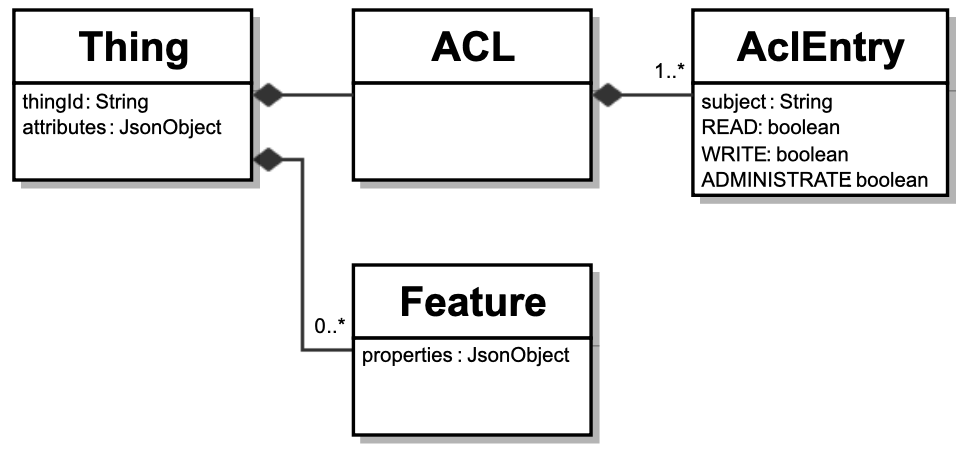
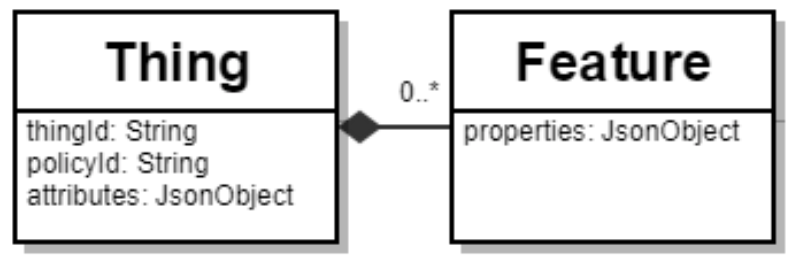
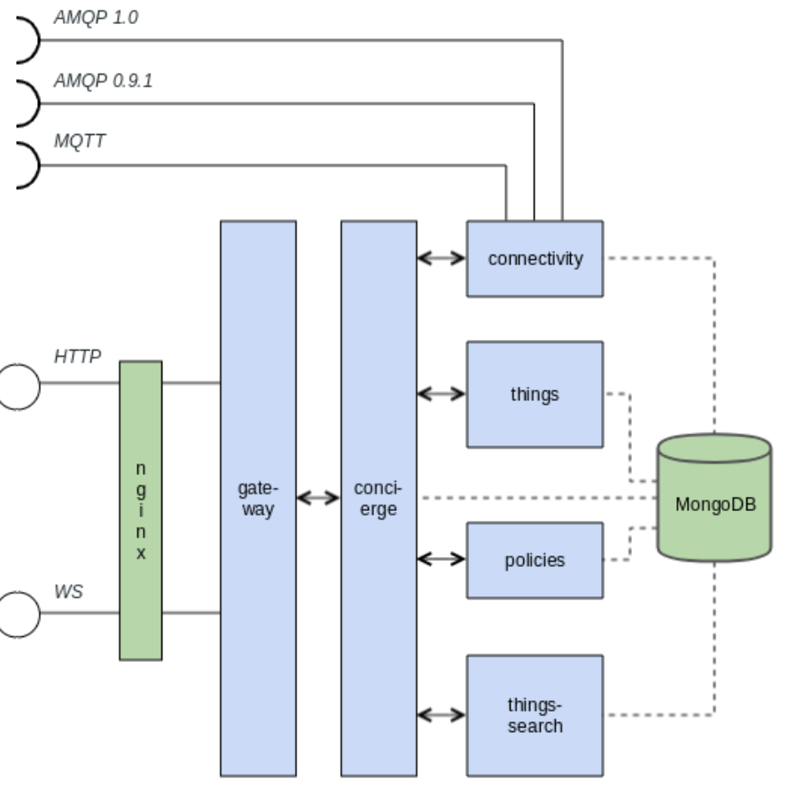
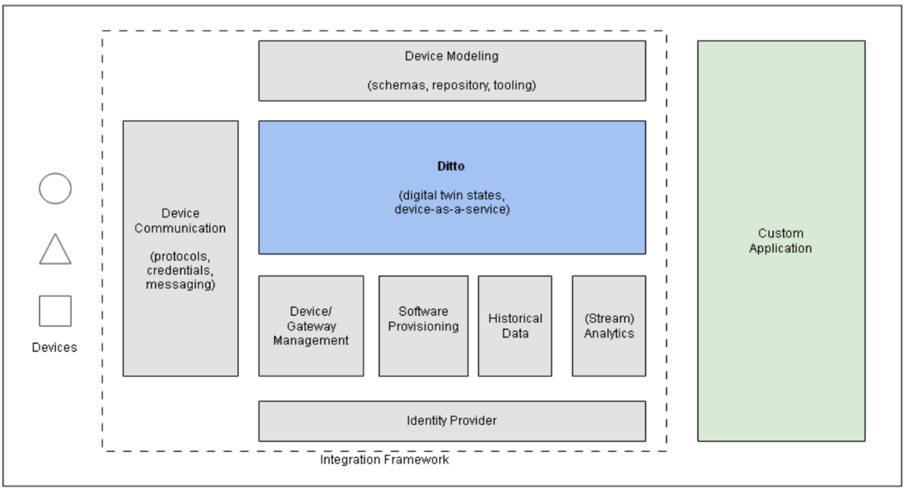

</img>

## Intro

<p align="justify">
Digital Twin is the virtual model of a physical product or even a process.
</p>

<table>
  
  <tr>
    <th width="20%"><a href="#about-digital-twin">About Digital Twin</a></th>
    <th width="20%"><a href="#industry-offerings">Industry Offerings</a></th>
    <th width="28%"><a href="#eclipse-ditto-implementation">Eclipse Ditto implementation</a></th>
    <th width="16%"><a href="#video">Video</a></th>
    <th width="16%"><a href="#contact">Contact</a></th>
  </tr>
    
</table>

## About Digital Twin
A Digital Twin is a virtual representation of a process, product or service.  This pairing of the virtual and physical worlds allows analysis of data and monitoring of systems to head off problems before they even occur, prevent downtime, develop new opportunities and even plan for the future by using simulations.  Digital twins consist of three components: a data model, a set of analytics or algorithms, and knowledge.

<p align="center">
  </img>
</p>

## Industry Offerings
There are multiple uses of Digital Twin across the value chain for enterprises:

<p align="center">
  </img>
</p>

Let us look at some of the commercial and FOSS (free, open source) offerings.

### GE Predix
GE has a digital platform called Predix.  It's [Asset](https://www.predix.io/resources/tutorials/tutorial-details.html?tutorial_id=1736&tag=1715&journey=Exploring%20Asset%20service&resources=1710,1736,1711,1951,2456) service allows modelling an asset to it's digital twin counterpart.  Also check out this compelling [video](https://youtu.be/2dCz3oL2rTw).

### Bosch
Bosch's IoT Suite enables applications to manage digital twins of their IoT device assets in a simple, convenient, robust, and secure way. Applications can store and update the data, properties, and relationships of assets and all relevant changes are notified.  It is marketed as "Bosch IoT Things".  Check it out [here](https://www.bosch-iot-suite.com/things/).

### Siemens
Siemens claims its PLM Suite covers all the hardware, software and electronic domains a digital twin needs.  Their suite covers  product simulations, plant simulations, manufacturing process simulations and maintenance simulations.  Check it out [here](https://community.plm.automation.siemens.com/t5/Digital-Twin-Knowledge-Base/Why-Siemens-digital-twin-capabilities-are-the-best-in-the-market/ta-p/432989).

### Dassault
Dassault Systèmes has a complete digital platform branded as [3DExperience](https://www.3ds.com/about-3ds/3dexperience-platform/).  Interestingly they have built a virtual replica of Singapore with [3DExperienCity](https://ifwe.3ds.com/natural-resources/3dexperiencityr).

### Microsoft
Microsoft Azure IoT has the concept of a [device twin](https://docs.microsoft.com/en-us/azure/iot-hub/iot-hub-devguide-device-twins) that is part of their device management solution. A device twin is automatically created when a device is connected to the MS IoT Hub. The device twin is a JSON file the stores the device state information that can be used synchronize device information with back-end processes.

### Amazon
Amazon refers to a [AWS IoT Device Shadow](https://docs.aws.amazon.com/iot/latest/developerguide/iot-device-shadows.html) as their version of a digital twin. A device shadow is a JSON file that contains the state information, meta-data, timestamp, unique client token and version of a device connected to the device shadow service. There are 3 basic REST APIs that can be used to interact with the device shadow: GET, UPDATE, DELETE. You can also interact with device shadows using MQTT messages.

### IBM
IBM has been one of the pioneers in the Digital twin space.  As part of the [Watson IoT platform](https://console.bluemix.net/docs/services/IoT/GA_information_management/ga_im_device_twin.html#device_twins) they have a [Device Twin](https://console.bluemix.net/docs/services/IoT/GA_information_management/ga_im_device_twin.html#device-twins) and an [Asset Twin](https://console.bluemix.net/docs/services/IoT/GA_information_management/ga_im_device_twin.html#asset-twins-things-).

### DXC
DXC's [Enterprise Asset Management](https://www.dxc.technology/enterprise_and_cloud_apps/offerings/145336/145391-powering_the_next_generation_of_connectivity_with_asset_management_and_iot) offering helps our customer's optimize asset performance, operational efficiency, and maintenance worker productivity by leveraging solutions from our strategic partners IBM, SAP and Oracle.

### Eclipse
The Eclipse Foundation is a not-for-profit organization with world-class professionals and Fortune 100 companies coming together for open source software collaboration and innovation. It is home to more than 350 open source projects, including runtimes, tools, and frameworks for a wide range of technology domains such as the Internet of Things, automotive, geospatial, systems engineering, etc.  [Eclipse Ditto](https://www.eclipse.org/ditto/) is the open-source project of Bosch (as part of the Bosch IoT Suite) that provides a ready-to-use functionality to manage the state of Digital Twins. It provides access to them and mediates between the physical world and their digital representation.

[</img>](#intro)

## Eclipse Ditto implementation
<p align="center">
  </img>
</p>

Ditto domain model for "Things" of IoT is very generic and a structure has two elements:
- Attributes: intended for managing static meta data of a Thing - as JSON object - which does not change frequently.
- Features: intended for managing state data (e.g. sensor data or configuration data) of a Thing.

Ditto provides two ways to interact with:

- a REST-like HTTP API with a sophisticated resource layout that allows to create, read, update and delete Things and the Thing’s data.
- a JSON-based WebSocket API implementing the Ditto Protocol.

The two ways are almost equally powerful and allow the same operations to work with the Thing’s data, send messages to Things and receive messages from Things.

- the lightweight REST-like HTTP API can be used
  - on less powerful devices lacking a Java runtime or supporting other (scripting) languages like JavaScript, Python, C/C++,
and for developing Web-based user interfaces.

- the WebSocket API proves useful for
  - gathering data streams from devices or massive data from another message broker,
  - real-time device monitoring,
  - event-driven Web applications,
  - full duplex communication scenarios, etc.
  
The REST-like HTTP API have been implemented as two versions: **API Version 1** and **API Version 2**.  In API Version 1, the information which subjects are allowed to READ, WRITE, ADMINISTRATE Things is inlined in the Things itself. This class diagram shows the structure Ditto requires for API version 1:
<p align="center">
  </img>
</p>  

Ditto persists Things as JSON and all of the APIs are also JSON based.  In API version 1 the most minimalistic representation of a Thing is for example the following (attributes and features are optional - here a minimalist Thing with one attribute and one feature is shown):
```
{
  "thingId": "the.namespace:the-thing-id",
  "acl": {
    "subject-id": {
      "READ": true,
      "WRITE": true,
      "ADMINISTRATE": true
    }
  },
  "attributes": {
    "location": "Kitchen"
  },
  "features": {
    "transmission": {
       "properties": {
         "cur_speed": 90
       }
     }
  }
}
```

In API version 2 the information which subjects are allowed to READ, WRITE Things are managed separately via Policies.
The Thing only contains a policyId which links to a Policy containing the authorization information. This class diagram shows the structure Ditto requires for API version 2:
<p align="center">
  </img>
</p>  

A minimalist JSON with one attribute and one feature is:
```
{
  "thingId": "the.namespace:the-thing-id",
  "policyId": "the.namespace:the-policy-id",
  "attributes": {
    "location": "Kitchen"
  },
  "features": {
    "transmission": {
       "properties": {
         "cur_speed": 90
       }
     }
  }
}
```

The components of a Ditto services include the following:
<p align="center">
  </img>
</p>

The components have the following tasks:
- Policies: persistence of Policies
- Things: persistence of Things and Features
- Things-Search: tracking changes to Things, Features, Policies and updating an optimized search index + executes queries on this search index
- Concierge: orchestrates and authorizes the backing persistence services
- Gateway: provides HTTP and WebSocket API
- Connectivity: sends Ditto Protocol messages to external message brokers and receives messages from them. 
Supported transport protocols are AMQP 1.0 (e.g. Eclipse Hono), AMQP 0.9.1 (e.g. RabbitMQ) or MQTT 3.1.1 (e.g. Eclipse Mosquitto).

Architecturally a Ditto application looks like this:
<p align="center">
  </img>
</p>

[</img>](#intro)

## Video
A short video on the implementations:

<p align="center">
  <a href="https://youtu.be/c47eI3ZcE2Q">
    </img>
  </a>
</p>

[</img>](#intro)

## Contact
Please contact us at [Vaidyanathan Sivasubramanian](mailto:vsivasubram3@dxc.com).

